  

  
  
  

### 🛠️ Building

| | |
| :-- | :-- |
| 🏛️ **SolveIt India** | Compliance CRM — 6 role-based portals, hardened Firestore rules, Gemini AI assistant |
| 🤝 **[Bharosa](https://github.com/prnv-maske/bharosa)** | *Udhaar ko credit banao* — turns kirana ledgers into verifiable credit records |

### 🧰 Stack

 

  
  

  

